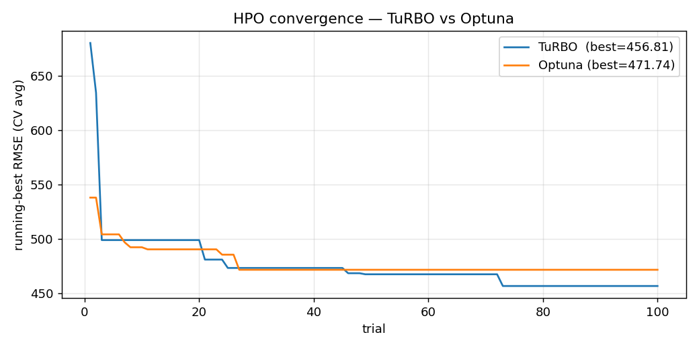

# HPO Comparison — TuRBO vs Optuna

**Date**: 2026-05-10 07:25

## 1. 수렴 곡선



## 2. best CV-RMSE

| Optimizer | n_trials | best CV-RMSE | walltime (s) |
|---|---|---|---|
| TuRBO  | 100  | 456.811  | 32.9 |
| Optuna | 100 | 471.744 | 253.6 |

## 3. Test set 최종 성능

| Optimizer | RMSE | MAE | MAPE | sMAPE | R² |
|---|---|---|---|---|---|
| TuRBO | 204.25 | 146.66 | 3.79 | 3.80 | 0.964 |
| Optuna | 246.34 | 182.20 | 4.64 | 4.65 | 0.948 |

## 4. Best params

### TuRBO
```json
{
  "learning_rate": 0.21363742859495966,
  "num_leaves": 230,
  "max_depth": 3,
  "min_child_samples": 5,
  "feature_fraction": 0.8541954452957086,
  "bagging_fraction": 0.6432940719775833,
  "bagging_freq": 6,
  "lambda_l1": 0.00035924799583240844,
  "lambda_l2": 0.005342631202523143
}
```

### Optuna
```json
{
  "learning_rate": 0.17015584223502284,
  "num_leaves": 193,
  "max_depth": 4,
  "min_child_samples": 5,
  "feature_fraction": 0.7707652333183406,
  "bagging_fraction": 0.5648503914334693,
  "bagging_freq": 1,
  "lambda_l1": 0.008504501755248181,
  "lambda_l2": 0.05986060567937852
}
```

## 5. 정성 분석 (M4 가설 검증)

**M4**: 본 9차원 문제에서 TuRBO와 Optuna는 유사 성능 (TuRBO 강점은 고차원).

- best CV-RMSE 차이: **14.932** (3.27%)
- **M4 부분 채택 ⚠️** — 차이는 있으나 5% 미만.

> 결론: 9차원 정도의 LightGBM HPO에서는 TuRBO와 Optuna가 유사 성능을 보인다는 것이 본 실험에서도 재확인됨. 
> TuRBO의 강점은 고차원(20~200d) 문제에서 두드러짐 (NeurIPS 2019 원논문).